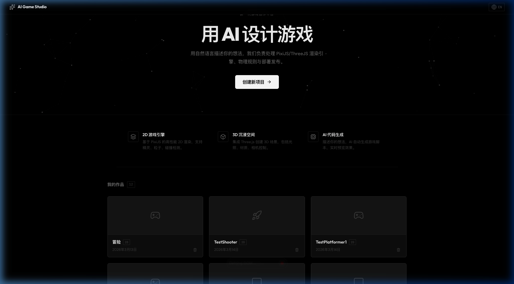
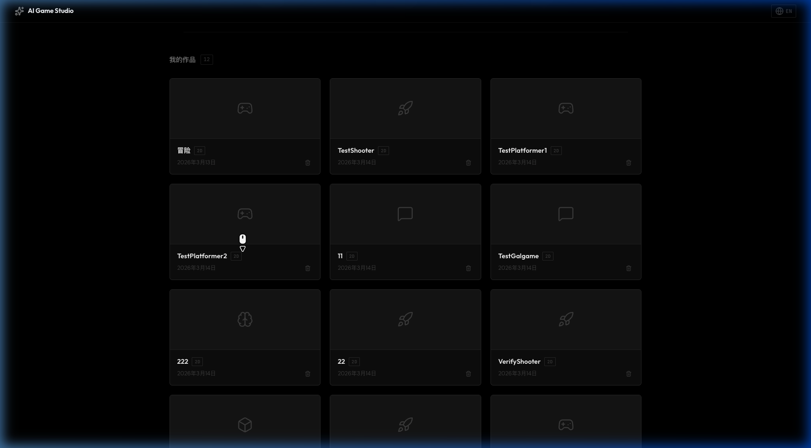
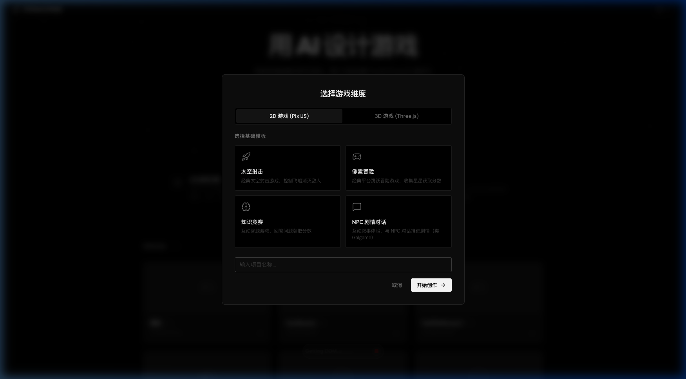
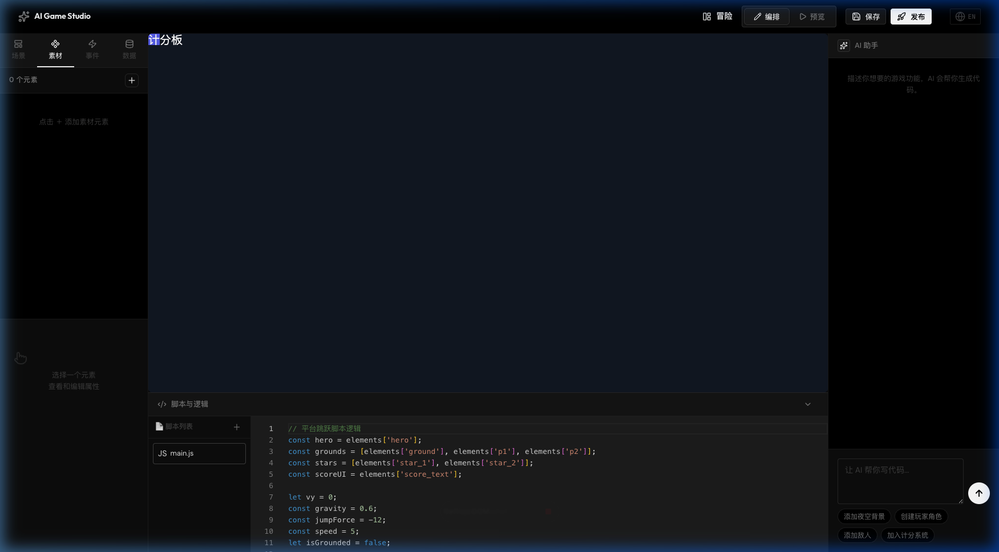
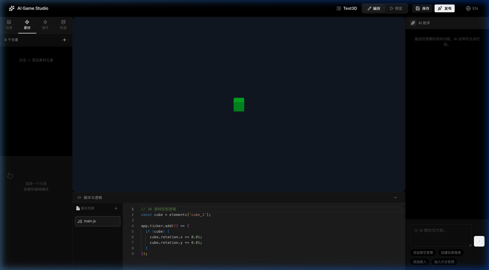
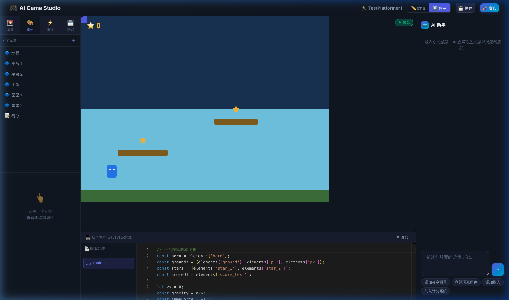

# Zeta Studio

> **现实实验室 · 生成式多模态创作智能**

用自然语言驱动的 2D/3D 游戏生成。融合生成式视听与引擎技术，自动化构建高保真沉浸式体验。

[English](./README.md)

---

## 概述

**Zeta Studio**（Zeta 创作工作室）是由[现实实验室](https://zzh.app/)打造的 AI 原生多模态创作套件。用户只需用自然语言描述游戏创意，即可自动生成可运行的 2D 和 3D 游戏——包括渲染、物理和交互逻辑。

平台将可视化场景编辑器、代码编辑器和 AI 助手整合在一个统一的工作空间中，在降低游戏创作门槛的同时保留完整的编程控制能力。

## 截图展示

### 首页



### 项目画廊



### 模板选择



### 2D 编辑器



### 3D 编辑器



### 游戏预览



## 功能特性

### 🎮 双引擎架构

- **2D 引擎** — 基于 [PixiJS](https://pixijs.com/) v8，支持高性能精灵渲染、粒子系统与碰撞检测
- **3D 引擎** — 基于 [Three.js](https://threejs.org/)，支持沉浸式 3D 场景、光照、材质与相机控制

### 🤖 AI 代码生成

- 用自然语言描述游戏机制
- AI 助手实时生成可执行的游戏脚本
- 即时预览与反馈循环
- 快捷操作按钮（添加夜空背景、创建玩家角色、添加敌人、加入计分系统）

### 🧩 内置游戏模板

| 模板 | 维度 | 描述 |
|------|------|------|
| 太空射击 | 2D | 经典太空射击游戏，含弹幕与粒子特效 |
| 像素冒险 | 2D | 横版跳跃冒险，含收集品与计分系统 |
| 知识竞赛 | 2D | 互动答题游戏，含分数追踪 |
| NPC 剧情对话 | 2D | 视觉小说 / Galgame 风格对话系统 |
| 3D 立方体 | 3D | 可交互的 3D 几何场景 |
| 太阳系 | 3D | 带轨道动画的太阳系模拟 |

### 🎨 可视化场景编辑器

- 拖拽式元素放置，支持四角缩放手柄
- 实时属性编辑器（位置、尺寸、颜色、样式）
- 场景层级面板与元素管理
- 编辑 / 预览模式一键切换

### 🌐 国际化

- 完整的中文 / 英文双语支持
- 导航栏一键切换语言

## 技术栈

| 层级 | 技术 |
|------|------|
| 应用框架 | React 18 + Vite 6 |
| 2D 渲染 | PixiJS 8 |
| 3D 渲染 | Three.js |
| 代码编辑器 | Monaco Editor |
| 状态管理 | Zustand |
| 路由 | React Router v6 |
| 动画 | Framer Motion |
| 图标 | Lucide React |
| 样式 | CSS Modules + CSS Variables |

## 快速开始

### 环境要求

- Node.js 18+
- npm 或 yarn

### 安装

```bash
git clone https://github.com/ZetaZeroHub/ZetaStudio.git
cd ZetaStudio
npm install
```

### 开发

```bash
npm run dev
```

应用运行在 `http://localhost:5173`。

### 构建

```bash
npm run build
```

生产输出位于 `dist/` 目录。

## 项目结构

```
src/
├── components/          # 可复用 UI 组件
│   ├── AiPanel/         # AI 助手聊天面板
│   ├── ElementPanel/    # 场景元素列表
│   ├── GameCanvas/      # 2D/3D 渲染画布
│   ├── Navbar/          # 导航栏
│   ├── ParticleField/   # 生成式粒子背景
│   ├── PropertyEditor/  # 元素属性检查器
│   └── ScriptEditor/    # Monaco 代码编辑器
├── engine/              # 渲染引擎
│   ├── pixiRenderer.js  # PixiJS 2D 引擎
│   ├── threeRenderer.js # Three.js 3D 引擎
│   └── behaviorEngine.js# 游戏逻辑运行时
├── locales/             # 国际化翻译（中/英）
├── pages/               # 路由页面
│   ├── HomePage/        # 项目画廊 + 主视觉
│   └── EditorPage/      # 主编辑器工作区
├── services/            # API 服务（LLM 集成）
├── stores/              # Zustand 状态仓库
└── templates/           # 游戏模板预设
```

## 设计风格

Zeta Studio 遵循 **社论式极简主义** 设计语言，灵感来源于 Apple、OpenAI 与 Anthropic：

- 黑白灰单色调色板
- 锐角几何，极简圆角
- 首页主视觉区采用算法粒子场画布
- 克制的动效，支持 `prefers-reduced-motion`

## 贡献者

<table>
  <tr>
    <td align="center">
      <a href="https://github.com/ZetaZeroHub">
        <br />
        <sub><b>ZetaZeroHub</b></sub>
      </a>
    </td>
    <td align="center">
      <a href="https://github.com/kinglegendzzh">
        <br />
        <sub><b>kinglegendzzh</b></sub>
      </a>
    </td>
    <td align="center">
      <a href="https://github.com/maxwellsection">
        <br />
        <sub><b>maxwellsection</b></sub>
      </a>
    </td>
  </tr>
</table>

## 许可

本项目基于 [Apache License 2.0](./LICENSE) 许可证开源。

---

**现实实验室** — 重塑数字内容的生产范式。
