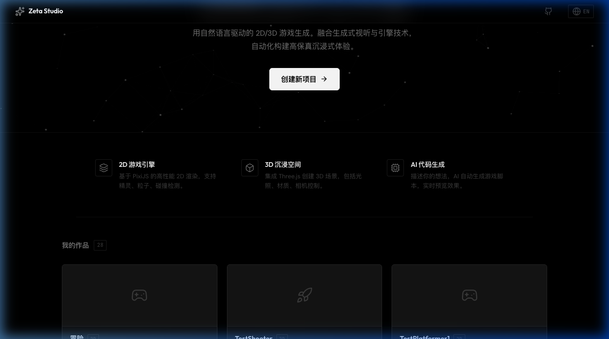
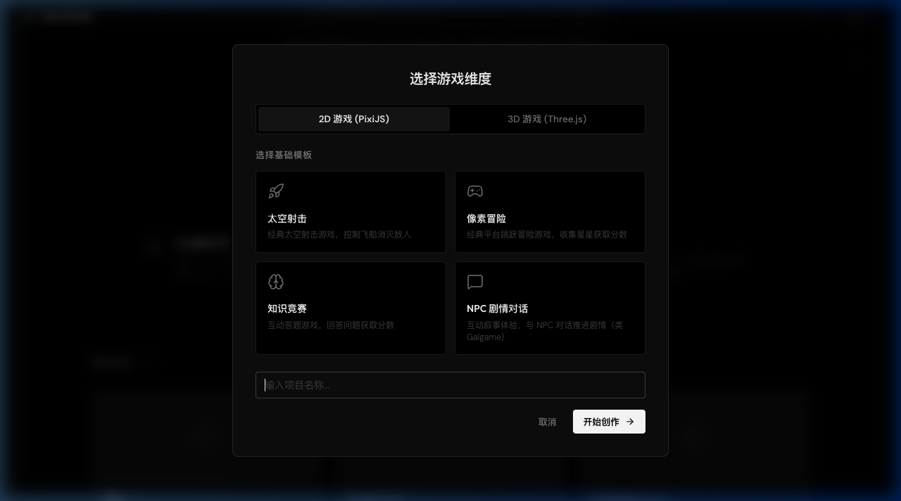
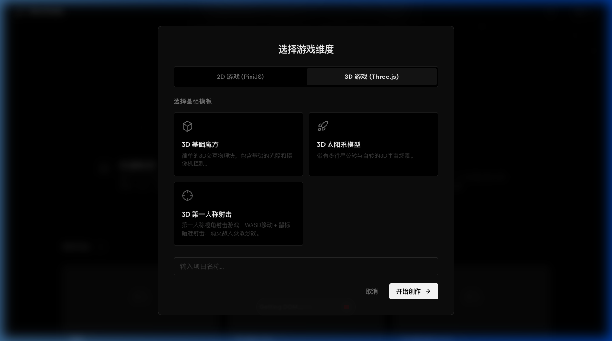
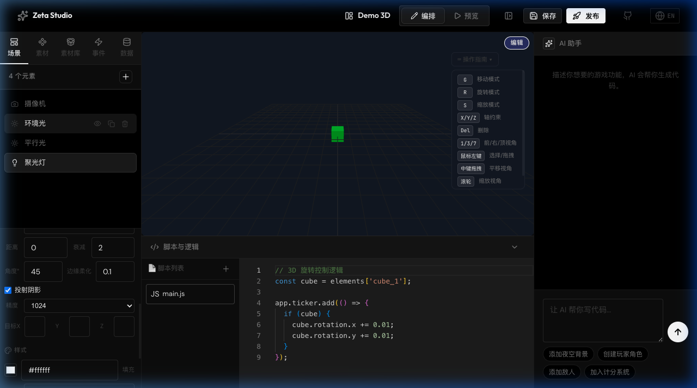
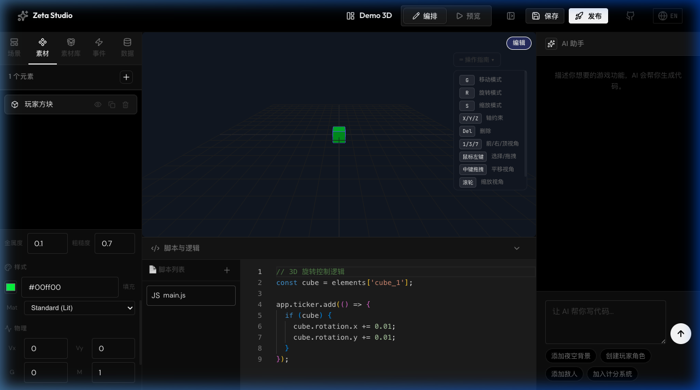

# Zeta Studio

> **现实实验室 · 生成式多模态创作智能**

用自然语言驱动的 2D/3D 游戏生成。融合生成式视听与引擎技术，自动化构建高保真沉浸式体验。

[English](./README.md)

### 🚀 产品已上线

| 产品 | 链接 | 简介 |
| --- | --- | --- |
| 🎮 **游戏梦想家** | **[game.zzh.app](https://game.zzh.app)** | 适龄 3-8 岁，通过「拖拉拽」的方式与 AI 趣味创作游戏 |
| 🛠️ **Zeta 创作工作室** | **[studio.zzh.app](https://studio.zzh.app)** | 专业级 2D/3D AI 游戏创作平台 |

---

## 概述

**Zeta Studio**（Zeta 创作工作室）是由[现实实验室](https://zzh.app/)打造的 AI 原生多模态创作套件。用户只需用自然语言描述游戏创意，即可自动生成可运行的 2D 和 3D 游戏——包括渲染、物理和交互逻辑。

平台将可视化场景编辑器、代码编辑器和 AI 助手整合在一个统一的工作空间中，在降低游戏创作门槛的同时保留完整的编程控制能力。

## 截图展示

### 首页


### 功能特性展示



### 模板选择 — 2D 游戏



### 模板选择 — 3D 游戏



### 2D 编辑器


### 3D 编辑器 — 高级光照



### 3D 编辑器 — 快捷键指南



---

## 功能特性

### 🎮 双引擎架构

- **2D 引擎** — 基于 [PixiJS](https://pixijs.com/) v8，支持高性能精灵渲染、粒子系统与碰撞检测
- **3D 引擎** — 基于 [Three.js](https://threejs.org/)，支持沉浸式 3D 场景、PBR 材质与实时阴影

### 🤖 AI 代码生成

- 用自然语言描述游戏机制
- AI 助手实时生成可执行的游戏脚本
- 即时预览与反馈循环
- 快捷操作按钮（添加夜空背景、创建玩家角色、添加敌人、加入计分系统）

### 🧩 内置游戏模板

| 模板 | 维度 | 描述 |
|------|------|------|
| 太空射击 | 2D | 经典太空射击游戏，含弹幕与粒子特效 |
| 像素冒险 | 2D | 横版跳跃冒险，含收集品与计分系统 |
| 知识竞赛 | 2D | 互动答题游戏，含分数追踪 |
| NPC 剧情对话 | 2D | 视觉小说 / Galgame 风格对话系统 |
| 横版闯关 | 2D | 带敌人、Boss、商人的横版平台冒险（地图编辑器） |
| AI 迷宫创作 | 2D | AI 辅助俯视角迷宫创作，7种风格/11种主角/7种终点 |
| 3D 魔方 | 3D | 可交互的 3D 几何场景 |
| 太阳系 | 3D | 带轨道动画的太阳系模拟 |
| 3D 第一人称射击 | 3D | FPS 射击游戏，含指针锁定与计分 |

### 🏗️ AI 迷宫创作编辑器

面向 2-6 岁儿童的俯视角迷宫创作工具：

- **创作流程** — 选风格 → 画路线 → 一键生成 → 体验游戏 → 发布/保存
- **7 种地图风格** — 森林、秋天、冬天、糖果、城市、村庄、赛车
- **11 种可选主角** — 小鸭子（8方向行走动画）+ 10 种单图角色
- **7 种终点目标** — 水池（涟漪动画）+ 6 种精灵图目标
- **智能生成算法 v4** — 3-Pass 覆盖、转弯直线约束、2×2 密集块清理
- **9 层 Canvas 渲染引擎** — 草地/道路/装饰/角色/标记分层渲染
- **草稿编辑模式** — 保存/恢复全部创作上下文
- **专业模式集成** — 模板抽屉入口 + 我的作品合并展示

### 🕹️ 横版闯关关卡编辑器

完整的横版平台跳跃游戏关卡创作与游玩系统：

**关卡编辑器**（GameEditorPage + EditorCanvas）
- **PixiJS 画布编辑器** — 32px 网格对齐、元素拖拽、缩放（0.25x-3x）、平移漫游
- **三种工具** — 选择（点击选中/拖动元素）、画笔（连续绘制/单次放置）、橡皮擦
- **11 类素材库（300+ 素材）** — 普通地形（6种材质×7变体）、特殊地形（岩浆/水/传送带/坡道）、建筑砖块、可收集品（金币/宝石/星星）、道具（钥匙/蘑菇/火球）、机关（弹簧/尖刺/炸弹/开关/锯齿/梯子）、门与出口、敌人（6种怪物）、角色（4色玩家）、装饰物、背景（8种场景+25种背景元素）
- **属性检查器** — 底部弹出面板展示选中元素类型与属性（地形/物品/敌人/机关/出生点/出口）
- **AI 关卡设计助手** — 可调宽度的右侧面板，LLM 辅助用自然语言设计关卡布局
- **草稿管理** — 自动保存（60秒间隔）+ 手动保存 + 多版本保存记录 + 发布到「我的作品」
- **开场动画** — 打开编辑器时先缩放展示全貌，再平滑聚焦到玩家出生点

**横版游戏引擎**（MazeGamePage）
- **物理引擎** — 重力、水平移动、跳跃、碰撞检测（地面/平台/墙壁）、坠落判定
- **战斗系统** — 泡泡/火球/水弹三种武器 × 弹道射击 × 瞄准角度、敌人 AI 巡逻、Boss 战斗（血条 + 2倍体型）
- **商人系统** — NPC 商人（按主题切换动物精灵）售卖护盾/疾风靴/金币磁铁/二段跳/额外生命
- **关卡机关** — 问号砖（撞击出物品）、可破砖（击碎动画）、弹簧、传送门、钥匙锁门、水陷阱
- **HUD** — 生命值❤️、金币计数、计时器、武器指示、元素切换
- **触控适配** — 虚拟摇杆（左方向 + 右跳跃/攻击）、点击商人交互
- **音效系统** — 跳跃、着陆、射击、收集、受伤等即时合成音效

### 🎨 可视化场景编辑器

- 拖拽式元素放置，支持四角缩放手柄
- 实时属性编辑器（位置、尺寸、颜色、样式）
- 场景层级面板与元素管理
- 编辑 / 预览模式一键切换
- 3D 编辑器操作指南面板（G/R/S 变换、X/Y/Z 轴约束、1/3/7 视角切换）

### 💡 高级 3D 光照系统

| 光源类型 | 功能特性 |
|---------|---------|
| 环境光 | 全局均匀照明，颜色 + 强度可调 |
| 平行光 | 方向光照 + PCFSoft 阴影映射 + 阴影精度/偏移/范围配置 + 目标坐标 |
| 点光源 | 辐射光照 + 距离衰减 + 可选阴影 |
| 聚光灯 ✨ | 锥形光照 + 角度/半影/衰减 + 阴影 + 目标坐标 |
| 半球光 ✨ | 天空色 + 地面色双色照明 |

- **PBR 材质** — MeshStandardMaterial 支持金属度（Metalness）与粗糙度（Roughness）调节
- **实时阴影** — PCFSoftShadowMap + ACES Filmic 色调映射
- **脚本可控** — 所有光照属性可通过 `elements['light_id']` 在脚本中动态修改

### 🌌 天空盒 / 环境映射

- **纯色模式** — 自定义背景颜色
- **全景图模式** — 上传 equirectangular 全景图作为环境贴图
- 支持 `.jpg`, `.png`, `.hdr`, `.webp` 格式
- 全景图自动应用为 `scene.background` + `scene.environment`（PBR 环境反射）

### 📦 3D 素材库

- 内置 12+ 开源 3D 模型（交通工具、动物、建筑等）
- 支持 `.glb/.gltf/.obj` 格式模型导入
- 自动归一化缩放 + 场景集成

### 🖼️ 2D 素材库

- 内置 20+ 精灵素材（角色、道具、地形等）
- 支持本地图片上传（存储至 localStorage）
- 图片异步加载，占位符自动替换

### 🌐 国际化 & 响应式

- 完整的中文 / 英文双语支持
- 导航栏一键切换语言
- 移动端、平板端自适应布局

### 🔗 三元联动架构

所有功能遵循「脚本代码 · 可视化面板 · AI 助手」三元联动设计：

1. **脚本可编辑** — Monaco 代码编辑器支持完整的 JavaScript 编程
2. **面板可视化** — 左侧属性面板实时展示与修改所有元素属性
3. **AI 可调整** — 右侧 AI 助手可通过自然语言动态生成/修改代码

### 🎬 多场景管理系统

- **独立场景** — 每个场景拥有独立的元素列表、脚本代码和背景设置
- **场景选择器** — 场景标签页顶部水平卡片式场景切换，支持新增/删除
- **场景背景** — 每个场景可自定义背景（纯色选择器 / 本地图片上传）
- **脚本场景跳转** — 预览模式脚本可调用 `switchScene(sceneId)` 实现场景间切换
- **运行时 API** — `getCurrentSceneId()` / `getSceneList()` 查询场景信息
- **向后兼容** — 旧项目自动迁移为单场景格式，无数据丢失

---

## 技术栈

| 层级 | 技术 |
|------|------|
| 应用框架 | React 18 + Vite 6 |
| 2D 渲染 | PixiJS 8 |
| 3D 渲染 | Three.js (WebGLRenderer + PCFSoftShadowMap) |
| 代码编辑器 | Monaco Editor |
| 状态管理 | Zustand |
| 路由 | React Router v6 |
| 动画 | Framer Motion |
| 图标 | Lucide React |
| 样式 | CSS Modules + CSS Variables |

## 快速开始

### 环境要求

- Node.js 18+
- npm 或 yarn

### 安装

```bash
git clone https://github.com/ZetaZeroHub/ZetaStudio.git
cd ZetaStudio
npm install
```

### 开发

```bash
npm run dev
```

应用运行在 `http://localhost:5173`。

### 构建

```bash
npm run build
```

生产输出位于 `dist/` 目录。

## 项目结构

```
src/
├── components/          # 可复用 UI 组件
│   ├── AiPanel/         # AI 助手聊天面板
│   ├── ElementPanel/    # 场景元素列表 + 素材库
│   ├── GameCanvas/      # 2D/3D 渲染画布
│   ├── Navbar/          # 导航栏
│   ├── ParticleField/   # 生成式粒子背景
│   ├── PropertyEditor/  # 元素属性检查器（含光照/天空盒面板）
│   └── ScriptEditor/    # Monaco 代码编辑器
├── data/                # 素材库定义
│   └── assetLibrary.js  # 3D 模型 + 2D 精灵预设
├── engine/              # 渲染引擎
│   ├── pixiRenderer.js  # PixiJS 2D 引擎
│   ├── threeRenderer.js # Three.js 3D 引擎（含高级光照/天空盒）
│   └── behaviorEngine.js# 游戏逻辑运行时
├── locales/             # 国际化翻译（中/英）
├── pages/               # 路由页面
│   ├── HomePage/        # 项目画廊 + 主视觉
│   ├── EditorPage/      # 主编辑器工作区
│   ├── AiMazeCreatorPage/ # AI 迷宫创作编辑器
│   ├── MazePathGame/    # 俯视角迷宫游戏引擎
│   └── MazeHomePage/    # 迷宫首页 + 关卡选择
├── services/            # API 服务（LLM 集成）
├── stores/              # Zustand 状态仓库
├── utils/               # 工具函数（迷宫生成算法等）
└── templates/           # 游戏模板预设（含 FPS 射击）
```

## 设计风格

Zeta Studio 遵循 **社论式极简主义** 设计语言，灵感来源于 Apple、OpenAI 与 Anthropic：

- 黑白灰单色调色板
- 锐角几何，极简圆角
- 首页主视觉区采用算法粒子场画布
- 克制的动效，支持 `prefers-reduced-motion`

---

## 版本更新日志

| 版本 | 日期 | 更新内容 |
|------|------|---------|
| **v0.5.0** | 2026-03-22 | 🏗️ **AI 迷宫创作编辑器** — 俯视角迷宫创作工具（7种风格/11种主角/7种终点）、迷宫生成算法 v4（3-Pass 覆盖+转弯直线约束+密集块清理）、9 层 Canvas 渲染引擎、草稿编辑模式（保存/恢复上下文）、专业模式集成（模板入口+作品合并）、终点标识增强（旗帜+光环+奖牌 Layer9） |
| **v0.4.0** | 2026-03-15 | 🎬 **多场景管理系统** — 独立场景（元素/脚本/背景隔离）、场景选择器 UI、场景背景自定义（纯色/图片上传）、脚本 `switchScene()` 场景跳转 API、旧项目自动迁移兼容 |
| **v0.3.0** | 2026-03-15 | 🔦 **高级 3D 光照系统** — 聚光灯、半球光、PCFSoft 阴影映射、PBR 材质（金属度/粗糙度）；🌌 **天空盒** — 纯色/全景图模式 + 环境映射；🐛 修复 2D 事件/数据元素渲染多余蓝色方块 |
| **v0.2.1** | 2026-03-15 | 🎮 修复 3D 编辑器快捷键（G/R/S/Del/1/3/7）；🖱️ 修复 FPS 预览模式指针锁定残留；⚡ 修复快速编辑时元素消失（async 竞态）；🛡️ NaN/Infinity 变换值防护 |
| **v0.2.0** | 2026-03-14 | 📦 3D/2D 素材库 — 内置开源模型与精灵素材；⌨️ 3D 编辑器 Blender 风格快捷键系统；📱 移动端/平板自适应布局；🖼️ 2D 图片元素上传与异步加载 |
| **v0.1.0** | 2026-03-13 | 🎮 双引擎架构（PixiJS + Three.js）；🤖 AI 代码生成；🧩 6 款游戏模板；🎨 可视化场景编辑器；🌐 中英双语 |

---

## 贡献者

<table>
  <tr>
    <td align="center">
      <a href="https://github.com/ZetaZeroHub">
        <br />
        <sub><b>ZetaZeroHub</b></sub>
      </a>
    </td>
    <td align="center">
      <a href="https://github.com/kinglegendzzh">
        <br />
        <sub><b>kinglegendzzh</b></sub>
      </a>
    </td>
    <td align="center">
      <a href="https://github.com/maxwellsection">
        <br />
        <sub><b>maxwellsection</b></sub>
      </a>
    </td>
  </tr>
</table>

## 许可

本项目基于 [Apache License 2.0](./LICENSE) 许可证开源。

---

**现实实验室** — 重塑数字内容的生产范式。
